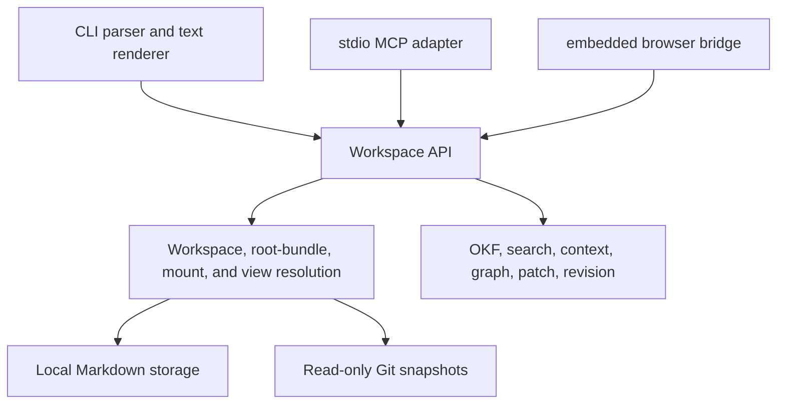

# Factile CLI Architecture

> **Implementation status:** the workspace/bundle flow below is the accepted
> Root Layout v2 target under `ft-qhg`. Released v0.3.1 still uses the legacy
> active-root resolver.

Factile is one local Go engine with three local adapters: the command line, a
stdio MCP server, and an embedded browser reader. All three operate on the same
workspace API and address knowledge with Factile paths.

## Boundaries

| Area | Current responsibility |
|---|---|
| `cmd/factile` | Starts the process and delegates to the CLI adapter. |
| `internal/cli` | Parses global options and commands, maps them to workspace calls, selects text or JSON output, and maps errors to exit codes. |
| `internal/cli/render` | Human-oriented help, summaries, reader output, confirmations, and color. It does not define the stable data model. |
| `pkg/factile` | Public workspace operations, result models, error codes, reader behavior, mutation ordering, mounts, views, and summaries. |
| `pkg/vfs` | Parses `factile.toml`, discovers the nearest workspace, normalizes virtual paths, and resolves root-bundle and descriptor-backed sources. |
| `pkg/storage` and `pkg/okf` | Read and write local Markdown concepts and parse or validate OKF content. |
| `pkg/gitsource` | Classifies Git remotes and maintains immutable read-only snapshots below workspace-local state. |
| `pkg/search`, `pkg/contextpack`, and `pkg/graph` | Derive search results, bounded context, and Markdown-link graphs from visible concepts. |
| `pkg/patch` and `pkg/revision` | Apply targeted Markdown changes and compute optimistic document revisions. |
| `pkg/mcpserver` | Exposes the workspace through local stdio tools, with an explicit read-only mode. |
| `pkg/uibridge` | Serves the embedded local reader and its loopback workspace API. |
| `pkg/bootstrap`, `pkg/skill`, and `pkg/profile` | Initialize workspaces and bundles, install agent guidance, and load optional profile data. |
| `pkg/trace` | Appends opt-in local diagnostic events when `FACTILE_TRACE_FILE` is set. |

## Workspace and read flow

The resolver finds the nearest ancestor `factile.toml` containing `[workspace]`
or validates the exact `--workspace` directory. Discovery crosses Git
boundaries and has no nearby-docs or bundle fallback. `[workspace].root`
selects a bundle manifest whose content supplies logical `/`. Descriptor files
named `<child>.mount.toml` inside that root bundle add child sources at paths
derived from physical placement. Workspace-level `factile.views.toml` can
narrow supported reader commands.

A reader call then:

1. normalizes the requested Factile path;
2. loads workspace, root-bundle, mount, view, and cached Git status;
3. resolves one readable source or a virtual folder;
4. reads visible OKF concepts from local storage or an immutable Git snapshot;
5. derives search, context, graph, validation, or summary results; and
6. returns one typed result to the calling adapter.

Readers never need to know whether the resolved source is root-bundle-local, a local
mount, or a cached Git mount.

## Write flow

The root bundle is writable. Explicit mounts are read-only by default; only a
local mount created with `--writable` can opt into mutation. Git mounts remain
read-only.

Existing-document writes require the revision last observed by the caller. The
workspace checks source capability, locks mutable state, reads the latest
document, compares the revision, performs the change, validates the result, and
re-reads it before returning. Capability and revision checks live in the
workspace layer so CLI, MCP, and UI adapters cannot bypass them.

Rename changes one path and reports backlink warnings; it does not rewrite
other documents. Patch operations preserve unrelated body sections and unknown
frontmatter unless the caller explicitly changes them.

## Interface stability

Workspace result structs and JSON output are the script and agent interface.
Human text is a presentation layer and may improve without changing those
models. The MCP server reuses workspace operations instead of defining another
knowledge model.

## Product boundary

This repository implements local workspaces, portable bundles, local mounts, pull-only Git mounts,
local MCP, and a loopback browser. It does not own hosted source resolution,
remote writes, authentication products, billing, marketplaces, publication
workflows, or cloud synchronization.

The repository's tests and `scripts/verify.sh` are the executable proof of
these boundaries. Public builds and tests do not require a private contract or
sibling repository.
