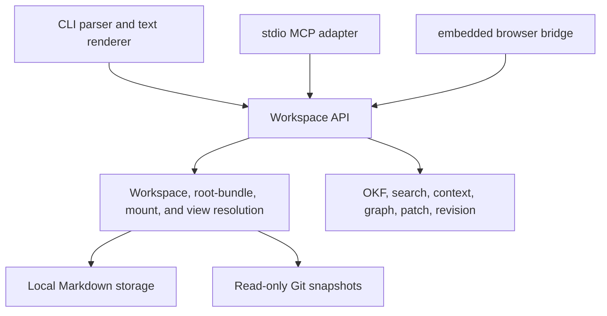

# Factile CLI Architecture

Factile is one local Go engine with three local adapters: the command line, a
stdio MCP server, and an embedded browser reader. All three operate on the same
workspace API and address knowledge with Factile paths.


```mermaid
flowchart TD
    CLI[CLI parser and text renderer]
    MCP[stdio MCP adapter]
    UI[embedded browser bridge]
    WS[Workspace API]
    VFS[Workspace, root-bundle, mount, and view resolution]
    LOCAL[Local Markdown storage]
    GIT[Read-only Git snapshots]
    OPS[OKF, search, context, graph, patch, revision]

    CLI --> WS
    MCP --> WS
    UI --> WS
    WS --> VFS
    WS --> OPS
    VFS --> LOCAL
    VFS --> GIT
```

## Boundaries

| Area | Current responsibility |
|---|---|
| `cmd/factile` | Starts the process and delegates to the CLI adapter. |
| `internal/cli` | Parses global options and commands, maps them to workspace calls, selects text or JSON output, and maps errors to exit codes. |
| `internal/cli/render` | Human-oriented help, summaries, reader output, confirmations, and color. It does not define the stable data model. |
| `pkg/factile` | Public workspace operations, result models, error codes, reader behavior, mutation ordering, mounts, views, and summaries. |
| `pkg/vfs` | Parses `factile.toml`, discovers the nearest workspace, normalizes virtual paths, and resolves root-bundle and descriptor-backed sources. |
| `pkg/storage` and `pkg/okf` | Read and write local Markdown concepts and parse or validate OKF content. |
| `pkg/gitsource` | Classifies Git remotes and maintains immutable read-only snapshots below workspace-local state. |
| `pkg/search`, `pkg/contextpack`, and `pkg/graph` | Derive search results, bounded context, and Markdown-link graphs from visible concepts. |
| `pkg/patch` and `pkg/revision` | Apply targeted Markdown changes and compute optimistic document revisions. |
| `pkg/mcpserver` | Exposes the workspace through local stdio tools, with an explicit read-only mode. |
| `pkg/uibridge` | Serves the embedded local reader and its loopback workspace API. |
| `pkg/bootstrap`, `pkg/skill`, and `pkg/profile` | Initialize workspaces and bundles, install agent guidance, and load optional profile data. |
| `pkg/trace` | Appends opt-in local diagnostic events when `FACTILE_TRACE_FILE` is set. |

## Workspace and read flow

The resolver finds the nearest ancestor `factile.toml` containing `[workspace]`
or validates the exact `--workspace` directory. Discovery crosses Git
boundaries and has no nearby-docs or bundle fallback. `[workspace].root`
selects a bundle manifest whose content supplies logical `/`. Descriptor files
named `<child>.mount.toml` inside that root bundle add child sources at paths
derived from physical placement. Workspace-level `factile.views.toml` can
narrow supported reader commands.

A reader call then:

1. normalizes the requested Factile path;
2. loads workspace, root-bundle, mount, view, and cached Git status;
3. resolves one readable source or a virtual folder;
4. reads visible OKF concepts from local storage or an immutable Git snapshot;
5. derives search, context, graph, validation, or summary results; and
6. returns one typed result to the calling adapter.

Readers never need to know whether the resolved source is root-bundle-local, a local
mount, or a cached Git mount.

## Write flow

The root bundle is writable. Explicit mounts are read-only by default; only a
local mount created with `--writable` can opt into mutation. Git mounts remain
read-only.

Existing-document writes require the revision last observed by the caller. The
workspace checks source capability, locks mutable state, reads the latest
document, compares the revision, performs the change, validates the result, and
re-reads it before returning. Capability and revision checks live in the
workspace layer so CLI, MCP, and UI adapters cannot bypass them.

Rename changes one path and reports backlink warnings; it does not rewrite
other documents. Patch operations preserve unrelated body sections and unknown
frontmatter unless the caller explicitly changes them.

## Interface stability

Workspace result structs and JSON output are the script and agent interface.
Human text is a presentation layer and may improve without changing those
models. The MCP server reuses workspace operations instead of defining another
knowledge model.

## Concept Schema v1 adoption boundary

The accepted Concept Schema v1 integration extends the existing `Validate`
workspace operation; it does not add another command or validator service.
The workspace Validate operation now applies base OKF and bundle-local concept
schemas. Completion of adapter adoption additionally requires the CLI, MCP and
reader presentation checks and the contract-owned CLI replay. Local worktree
evidence is tracked separately from deferred committed-pin and hosted CI proof.

Validation first produces the base OKF result, then evaluates every base-valid
concept against profiles owned by its physical bundle. The root bundle and each
mounted source load only their own direct-child `concept-schemas/*.schema.json`
files. A logical path, mount path, or view never creates schema inheritance or a
workspace registry.

The JSON model keeps the existing top-level `path`, `valid`, and `issues`
fields. `valid` is the aggregate command outcome and `issues` is the ordered
adapter issue list. Two additive fields preserve the independently named
results:

```json
{
  "path": "/",
  "valid": true,
  "issues": [],
  "okf": {
    "valid": true,
    "issues": []
  },
  "concept_schemas": [
    {
      "bundle_path": "/reference",
      "scope_paths": ["/reference"],
      "complete_bundle": true,
      "result": {
        "contract": "concept-schema/v1",
        "conformant": true,
        "schemas": [],
        "evaluated_concepts": 0,
        "issues": []
      }
    }
  ]
}
```

`bundle_path` is the logical mount point used to map bundle-relative portable
paths to adapter paths. Entries are ordered by `bundle_path`. `scope_paths`
records the effective logical path or view intersections. `complete_bundle` is
true only when those intersections include the whole physical bundle. Its
`result` is the exact portable Concept Schema report when every concept also
passes base OKF. A narrower path or view uses the same result fields but omits
`contract`; it is scoped validation. Base-invalid concepts are excluded and
counted in `skipped_concepts`, and their result also omits `contract`. An
unavailable bundle has `skipped_reason` and no `result`. Operational evaluator
failures abort validation rather than returning an empty successful report.
Schema lists and evaluated counts distinguish no definitions, no matching types
and evaluated profiles. Unknown type names remain valid and unprofiled.

Top-level profile issues use the stable Concept Schema codes and logical
workspace paths while retaining `bundle_path`, `schema_id`, and `concept_type`
when defined. Base issues remain in `okf.issues`; all command-failing issues also
appear in the top-level ordered `issues` list. `valid` is true exactly when base
OKF is valid and every applicable profile result is conformant. After writing
the complete text or JSON result, the CLI returns exit code `3` when `valid` is
false. Local MCP and the UI bridge return the same workspace result without
reimplementing validation.

The reference implementation remains contract-owned Python. The public CLI uses
`go.yaml.in/yaml/v4` v4.0.0-rc.6 nodes with an explicit YAML 1.2 Core projection.
Small integers retain int64 values; larger integers and finite decimals use exact
JSON numbers. Duplicate or non-string keys, application tags, cycles and
non-finite numbers fail parsing. Frontmatter is limited to 1 MiB, 128 YAML levels
and 100,000 expanded nodes. Quoted scalars stay strings, including on write.
Metadata patches preserve unrelated bytes and support quoted keys and multiline
values; editing a flow-style root mapping reports an explicit error. Body edits
continue to preserve that mapping.

The focused `pkg/conceptschema` engine uses
`github.com/santhosh-tekuri/jsonschema/v6` v6.0.3. It accepts one physical bundle
root and base-valid concept values, discovers direct regular schema candidates,
qualifies executable local pointer targets, blocks duplicate ownership and returns
the exact portable report with separate field diagnostics. Workspace validation
passes each root or mount's physical source path, including cached Git snapshots,
and deduplicates overlapping view selections within each bundle. Only explicit
Validate operations invoke profiles; bootstrap's local root health check and
document writes retain their existing base OKF checks. The public CLI has no runtime or test dependency
on the private contract repository.

Operational limits include 128 candidates, 1 MiB per schema, 128 JSON levels,
64 reference traversals and one million units of conservative possible evaluation
work. The preflight visits possible branches for the supplied instance and charges
quadratic comparisons before evaluation; it can reject otherwise valid large
inputs. Numeric arithmetic limits precision to 4096 lexical characters and 10,000
exponent places. Regular expressions use the existing regexp2 dependency with a
50 ms match timeout and a 4096-character pattern limit. Context deadlines and
these operational limits abort without returning a conformance report. External
resolution, coercion, default insertion and format assertions stay disabled.

The configured engine passes the pinned public Draft 2020-12 suite, including
exact-number and bounded-regex paths. To reproduce that qualification, set
`JSON_SCHEMA_TEST_SUITE_ROOT` to a clean checkout at
`9ad349be933f1e74810cb4fd3ad19780694dc77e` and run
`go test ./pkg/conceptschema -run TestDraft2020Qualification -v`. Ordinary
public tests use synthetic fixtures and skip this separately acquired suite. Write, create,
patch, rename, publishing, and reader availability do not acquire profile
enforcement from this integration.

## Product boundary

This repository implements local workspaces, portable bundles, local mounts, pull-only Git mounts,
local MCP, and a loopback browser. It does not own hosted source resolution,
remote writes, authentication products, billing, marketplaces, publication
workflows, or cloud synchronization.

The repository's tests and `scripts/verify.sh` are the executable proof of
these boundaries. Public builds and tests do not require a private contract or
sibling repository.
